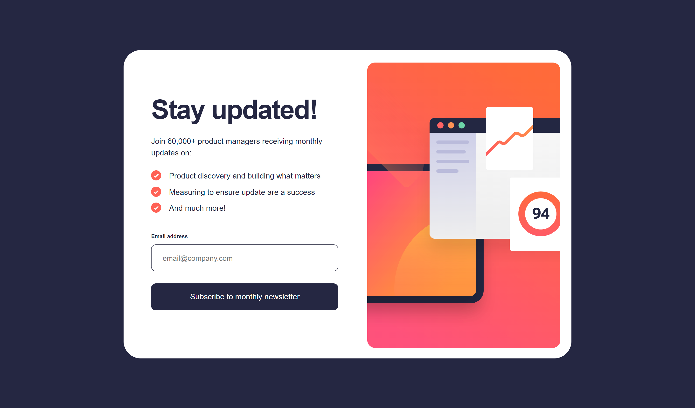
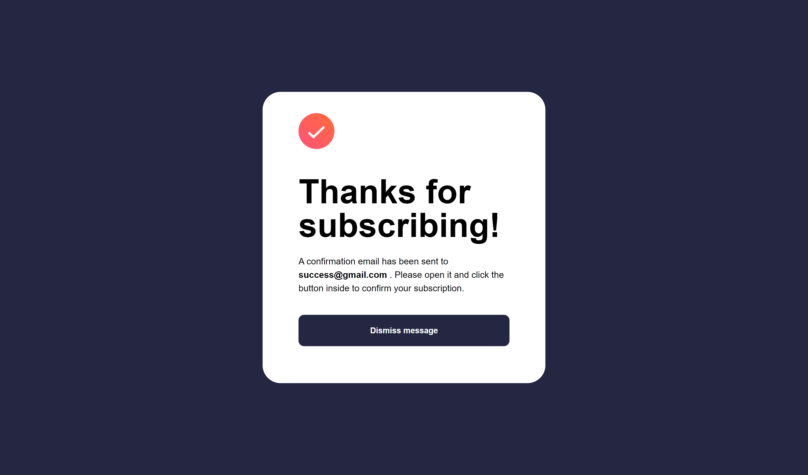
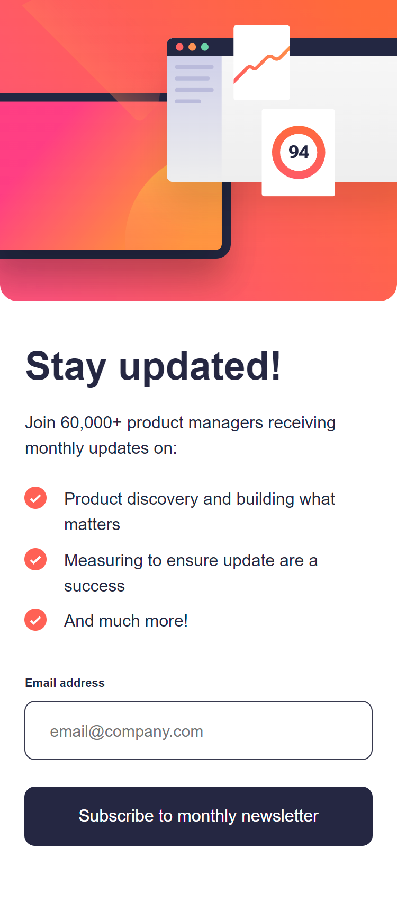
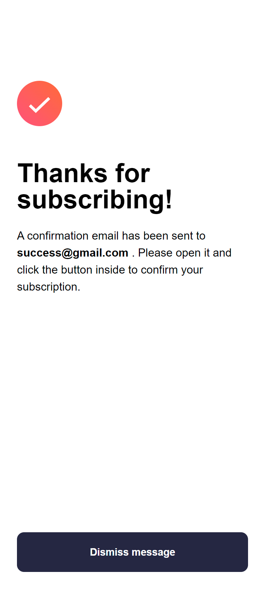

# Frontend Mentor - Newsletter sign-up form with success message solution

This is a solution to the [Newsletter sign-up form with success message challenge on Frontend Mentor](https://www.frontendmentor.io/challenges/newsletter-signup-form-with-success-message-3FC1AZbNrv). Frontend Mentor challenges help you improve your coding skills by building realistic projects.

## Table of contents

- [Overview](#overview)
  - [The challenge](#the-challenge)
  - [Screenshot](#screenshot)
  - [Links](#links)
- [My process](#my-process)
  - [Built with](#built-with)
  - [What I learned](#what-i-learned)
  - [Continued development](#continued-development)
  - [Useful resources](#useful-resources)
- [Author](#author)
- [Acknowledgments](#acknowledgments)

## Overview

### The challenge

Users should be able to:

- Add their email and submit the form
- See a success message with their email after successfully submitting the form
- See form validation messages if:
  - The field is left empty
  - The email address is not formatted correctly
- View the optimal layout for the interface depending on their device's screen size
- See hover and focus states for all interactive elements on the page

### Screenshot






### Links

- Solution URL: [Github Repository](https://github.com/Devs-advocate/fem-newsletter-signup)
- Live Site URL: [Netlify deployment](https://fem-challenge-newsletter-signup.netlify.app/)

## My process

I built the website in the order of HTML, then JavaScript, and then CSS. I feel that was the better process here as the styling can heavily influenced by the others, moreso than the other way around.

### Built with

- Semantic HTML5 markup
- CSS custom properties
- Flexbox
- Vanilla JavaScript
- Mobile-first workflow
- [SCSS](https://sass-lang.com/) - For styles

### What I learned

I learned about the autocomplete attribute that allows you to prevent the browser autocompleting inputs. The reason this was important is the difficulty in styling the input box to the required specifications due to the browser's builtin styling of autocomplete inputs.

```html
<input
  type="email"
  name="email"
  id="email"
  placeholder="email@company.com"
  autocomplete="off"
/>
<h1>Some HTML code I'm proud of</h1>
```

I experimented with the idea of having a HTML page for the signup screen and one for the success screen. The difficulty in that approach was carrying the email value from one page to another. This is possible using session or local storage; or query parameters, but I felt just having the one page would simplify the JS and CSS. It also made me think of the use frameworks have to manage state. Though the use of one would've unnecessarily overcomplicated the application.

In JS, I'm warming to nested ternary conditions. This is how I switched views for the signup and success screens. This was formatted by Prettier in VS Code.

```js
const changeView = () => {
  signupContainer.style.display === 'none'
    ? window.screen.width > 600
      ? (signupContainer.style.display = 'flex')
      : (signupContainer.style.display = 'block')
    : (signupContainer.style.display = 'none');
  successContainer.style.display === 'none'
    ? (successContainer.style.display = 'block')
    : (successContainer.style.display = 'none');
  emailInput.style.backgroundColor = 'white';
  emailInput.style.color = 'hsl(234, 29%, 20%)';
};
```

### Continued development

JavaScript is not easy, but the necessary code needed for this size and complexity of application wasn't troubling for me. I am learning both React and TypeScript to help my front end skills. CSS always catches me out with something and I'll need to keep the hours coming to get better at it. There's no other way really. I will spend more time looking at SVGs. I'm using SCSS regularly now, but I am eying Tailwind as a framework of interest.

## Author

- Website - [My GitHub](https://github.com/Devs-advocate)
- Frontend Mentor - [@Devs-advocate](https://www.frontendmentor.io/profile/Devs-advocate)

## Acknowledgments

Tip of the hat to Kevin Powell, a CSS guru who I look to at every FEM challenge for CSS guidance.
